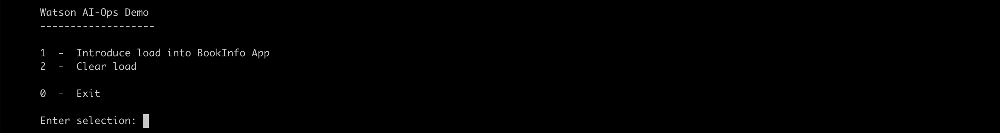

# Demo Script

Need to update few properties in the `config.sh`.

## Update Properties

#### 1. IBM Cloud API Key

1. Create IBM Cloud API Key for accessing IKS Cluster using the link [here](https://github.com/ibm-gsi-ecosystem/watson-ai-ops-guide/tree/master/602-accessing-iks-cluster-using-api-key) 

2. Update the below property.

```
IBMCLOUD_API_KEY=
```

#### 2. IKS Cluster Id

Update the iks cluster id in the below property.

```
IKS_CLUSTER_ID=csadfdasd0ohsnstmnnqg
```

#### 3. Application Url

Update the bookinfo app url

```
APP_URL=http://1.1.1.1:31010/productpage?u=normal
```

#### 4. Namespace

Update the NAMESAPCE property, with namespace where the aiops is installed.

```
NAMESAPCE=cp4waiops
```

## Demo Script

When you run `sh demo.sh` to start the demo, You will see the menu options like this.



Enter `0` to choose the menu option `0  -  Exit`, to exit from the menu.
