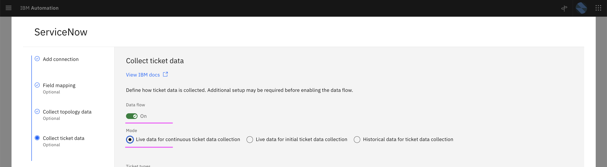
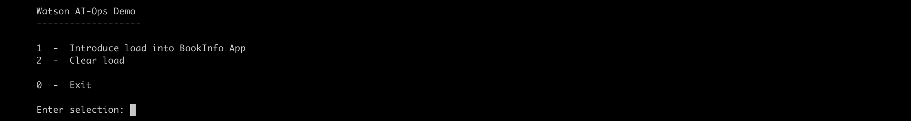

# Run Demo (Inferencing)

This article explains about how to run the Inferencing demo in Watson AIOps.

The article is based on the the following

- RedHat OpenShift 4.8 on IBM Cloud (ROKS)
- Watson AI-Ops 3.2.0

## 1. Enable Data flow in Humio Integration

1. Choose the `Humio` integration from the `Data and Tool integrations` page.

2. Enable the `Data flow` on.

3. Select the option `Live data for Continious AI training and anomaly detection`.

4. Save it.

## 2. Enable Data flow in ServiceNow Integration

1. Choose the `ServiceNow` integration from the `Data and Tool integrations` page.

2. Enable the `Data flow` on.

3. Select the option `Live data for Continious ticket data collection`.

4. Save it.

## 3. Run Demo Script

The demo script is avialable [here](../70-inferencing-demo-script). 

1. Run `sh demo.sh` to start the demo.

You will see the menu options like this.

2. Enter `1` to choose the menu option `1  -  Introduce load into BookInfo App`

This demo option will scale down the ratings pod to 0, push  2 error events to event manager. It will also access the bookinfo application through script. As a result, the log anomaly is created, grouped with events alerts and story will be created in the slack.  

3. As a result, the log anomaly is created and story will be created in the slack.  

## Next Step

By sucessful execution of the above demo step, the story would have been created and you can see them in the next section [72-inferencing-view-results](../72-inferencing-view-results).
